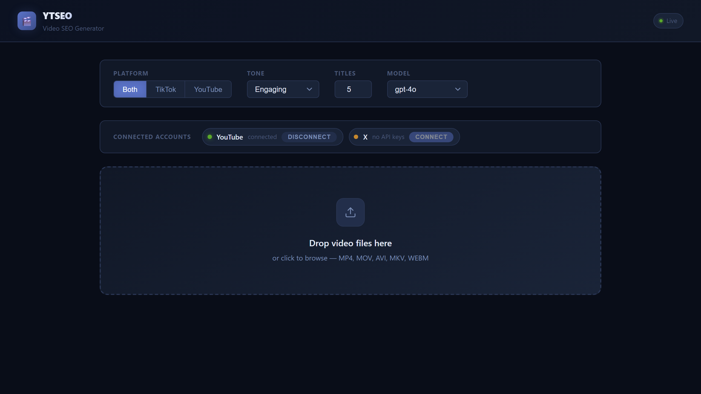
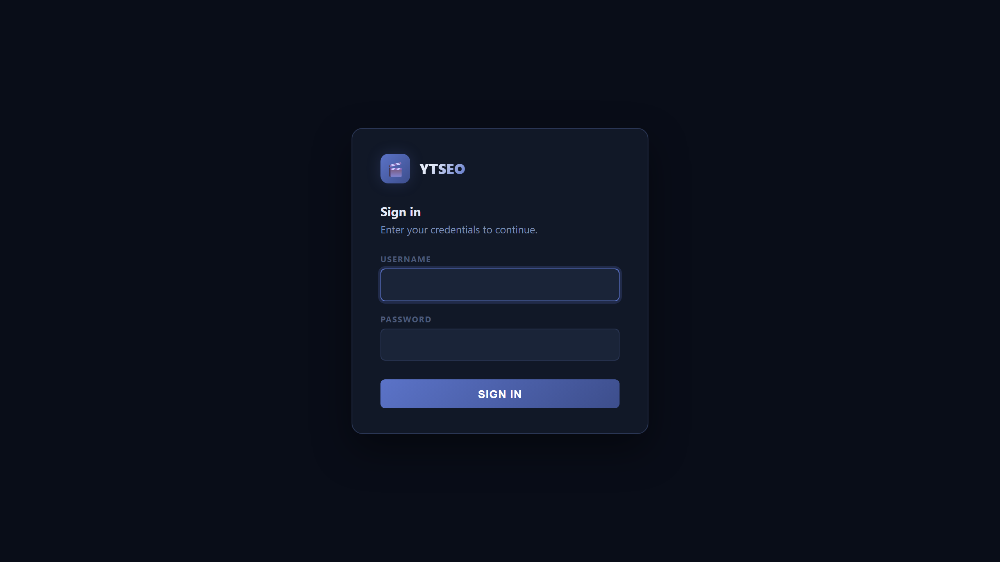
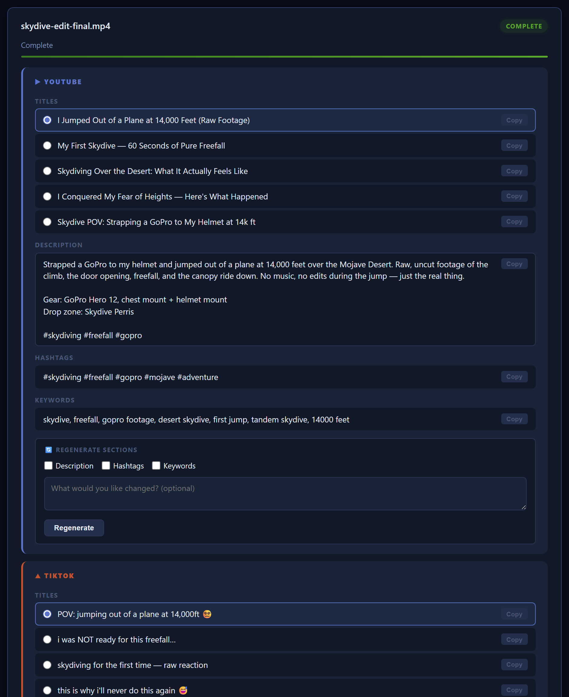
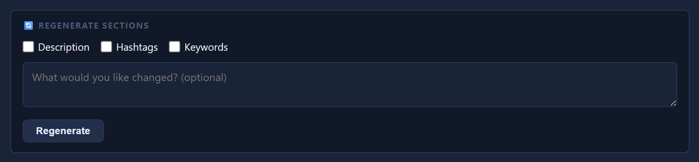
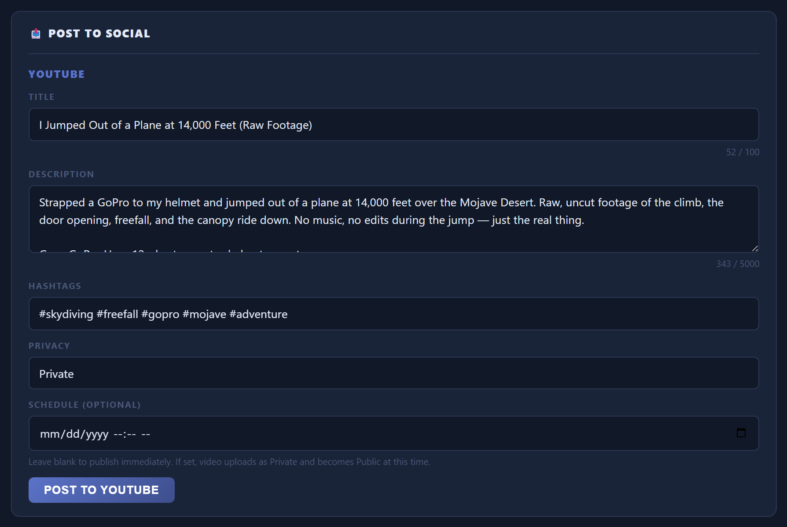

# YTSEO — Video SEO Generator
### By TimeTravlin Entertainment

> Drop a video. Get ready-to-paste titles, descriptions, and hashtags for TikTok and YouTube — in seconds.



Never stare at a blank "Add a description" box again. YTSEO listens to your video, figures out what it's actually about, and writes platform-optimized SEO content for you. It runs on your own computer — your video never gets uploaded anywhere.

---

## What does it do?

1. You drop a video file onto the app
2. It pulls the audio out and transcribes what's being said
3. An AI reads the transcript and writes titles, descriptions, and hashtags tailored to TikTok or YouTube's rules
4. You copy and paste the results straight into your post

That's it. No monthly subscription. No video upload to a cloud service. Just your video, your computer, and a free GitHub account.

---

## Before you start — what you'll need

Don't worry if you haven't heard of some of these. Each one has install instructions below.

| Thing | What it is | Cost |
|-------|-----------|------|
| **Python 3.11+** | The programming language this runs on | Free |
| **uv** | A tool that installs the app's code libraries | Free |
| **ffmpeg** | A tool that reads video files | Free |
| **GitHub account** | Lets you use the AI that writes the SEO content | Free |

---

## Step 1 — Install Python 3.11 or newer

Check if you already have it:
```
python --version
```
If it says `3.11` or higher, you're good. If not (or if the command isn't found):

- **Windows / macOS / Linux:** Download the installer from [python.org/downloads](https://www.python.org/downloads/) and run it.
  - On Windows, check the box that says **"Add Python to PATH"** during install — this is easy to miss.

Verify it worked:
```
python --version
```
You should see something like `Python 3.11.x`.

---

## Step 2 — Install uv

`uv` is the tool that downloads and manages all the Python libraries YTSEO needs.

**Windows** (open PowerShell and paste this):
```powershell
powershell -ExecutionPolicy ByPass -c "irm https://astral.sh/uv/install.ps1 | iex"
```

**macOS / Linux** (open Terminal and paste this):
```bash
curl -LsSf https://astral.sh/uv/install.sh | sh
```

After it finishes, **close and reopen your terminal**, then verify:
```
uv --version
```

> **Tip:** If you'd rather use plain `pip` instead of `uv`, skip this step and jump to the [pip install section](#alternative-install-with-pip) below.

---

## Step 3 — Install ffmpeg

ffmpeg is what reads your video files and pulls the audio out.

**Windows:**
```powershell
winget install ffmpeg
```
*(If `winget` isn't available, download from [ffmpeg.org/download.html](https://ffmpeg.org/download.html) and follow their Windows setup guide.)*

**macOS:**
```bash
brew install ffmpeg
```
*(Need Homebrew? Get it at [brew.sh](https://brew.sh))*

**Linux (Ubuntu/Debian):**
```bash
sudo apt install ffmpeg
```

Verify it worked:
```
ffmpeg -version
```
You should see a wall of version info. That means it's working.

---

## Step 4 — Download YTSEO

```bash
git clone https://github.com/JohnEhresmann3D/YTSEO_PressStart.git
cd YTSEO_PressStart
```

> **Don't have git?** You can also click the green **Code** button on the GitHub page and choose **Download ZIP**, then unzip it and open that folder in your terminal.

---

## Step 5 — Install the app

```bash
uv sync
```

This downloads all the Python libraries the app needs. It only takes a minute. You'll see a progress bar.

#### Alternative install with pip

If you skipped `uv` and want to use standard `pip`:
```bash
pip install -r requirements.txt
```

---

## Step 6 — Set up your free GitHub AI token

This is what lets the app write SEO content for you. It's completely free — you just need a GitHub account.

### 6a. Create a GitHub account (if you don't have one)

Go to [github.com](https://github.com) and sign up. It's free.

### 6b. Generate a token

1. Log into GitHub
2. Click your profile picture (top right) → **Settings**
3. Scroll all the way down the left sidebar → **Developer settings**
4. Click **Personal access tokens** → **Fine-grained tokens**
5. Click **Generate new token**
6. Give it a name like `ytseo`
7. Set an expiration date (90 days is fine, you can renew it)
8. You don't need to change any of the permissions — leave them as-is
9. Click **Generate token**
10. **Copy the token immediately** — GitHub will only show it once. It starts with `github_pat_` or `ghp_`

> **Important:** Treat this token like a password. Don't share it or post it anywhere.

### 6c. Save your token

In the `YTSEO_PressStart` folder, you'll find a file called `.env.example`. Make a copy of it named `.env`:

**Windows:**
```powershell
copy .env.example .env
```

**macOS / Linux:**
```bash
cp .env.example .env
```

Open `.env` in any text editor (Notepad is fine) and paste your token in:
```
GITHUB_TOKEN=github_pat_your_token_here
```
Save the file. That's it — the app will pick it up automatically.

---

## Step 7 — Launch the app

```bash
uv run ytseo-web
```

Then open your browser and go to:
```
http://localhost:8000
```

You should see the YTSEO interface. The terminal will show:
```
INFO | GitHub Models API enabled (model: gpt-4o)
INFO | Uvicorn running on http://127.0.0.1:8000
```

That means everything is working. 🎉

---

## Signing in

The app is protected by a simple username + password gate:



Defaults are `admin` / `pressstart` — **change them before exposing the app to the internet.** Set these in your `.env`:

```
YTSEO_ADMIN_USER=your_username
YTSEO_ADMIN_PASSWORD=your_long_password
YTSEO_SESSION_SECRET=<long random string>
```

`YTSEO_SESSION_SECRET` is what signs your login cookie. If you don't set it, the app generates a fresh one on every restart, which logs everyone out. Generate one with:

```bash
python -c "import secrets; print(secrets.token_urlsafe(48))"
```

Once signed in your session lasts 2 weeks. Visit `/logout` to end it early.

---

## How to use it


1. **Platform** — choose TikTok, YouTube, or Both
2. **Tone** — pick the vibe: Engaging, Humorous, Educational, Controversial, or Storytelling
3. **Titles** — how many title options you want (up to 10)
4. **Model** — which AI model to use (`gpt-4o` is the default and works great)


5. **Drop your video** onto the big upload area, or click it to browse your files
6. Watch the progress bar — it'll go through: extracting audio → transcribing → analyzing → generating
7. When it's done, click **Copy** next to any title, description, or hashtag set to copy it instantly



You can drop multiple videos at once and they'll queue up automatically.

> **Heads up on first use:** The first video will be slower than normal because it downloads the AI transcription model (~150 MB). Every video after that will be much faster.

### Picking the title you want

Each generated title appears as a selectable radio option. Click any title to make it the chosen one — if you have YouTube or X connected, the **Post to Social** panel at the bottom updates automatically to use whichever title you picked. No copy/paste needed.

### Regenerating just a section

Don't like the description? Want different hashtags? Each platform block has a **🔄 Regenerate sections** panel:



1. Check the boxes for the sections you want redone (Description, Hashtags, Keywords — any combination)
2. Optionally type what you'd like changed ("make it shorter", "more energetic", "drop the GoPro mention", etc.)
3. Click **Regenerate**

Only the selected sections are re-prompted — your title selection and everything else stays put.

### Posting directly from the app

Once a platform is connected (see below), each completed job shows a **Post to Social** panel:



- **Title / Description / Hashtags** — pre-filled from the SEO output and fully editable
- **Privacy** (YouTube) — Private, Unlisted, or Public
- **Schedule (optional)** (YouTube) — pick a future date/time and the video uploads as Private now and automatically goes Public at that moment. Leave blank to publish right away.
- Character counts update live so you don't blow past platform limits

---

## Auto-posting to YouTube and X (optional)

YTSEO can post a finished video straight to YouTube or X (Twitter) using the generated SEO content — no copy/paste needed. This is optional; if you skip it, the app still works as a content generator.

### YouTube

1. Go to [Google Cloud Console](https://console.cloud.google.com/) → create a project (or pick one)
2. **APIs & Services → Library** → enable **YouTube Data API v3**
3. **APIs & Services → Credentials** → **Create Credentials** → **OAuth client ID** → **Web application**
4. Add this **Authorized redirect URI** exactly:
   ```
   http://127.0.0.1:8000/api/auth/youtube/callback
   ```
5. Copy the **Client ID** and **Client Secret** into your `.env`:
   ```
   YOUTUBE_CLIENT_ID=...
   YOUTUBE_CLIENT_SECRET=...
   ```
6. Restart the app, click **Connect** next to YouTube in the UI, sign in with the Google account that owns your channel

### X (Twitter)

1. Go to [developer.x.com](https://developer.x.com/) → create a Project + App
2. Open **User authentication settings** → enable **OAuth 2.0**
3. Required scopes: `tweet.read tweet.write users.read media.write offline.access`
4. Set the **Callback URL** to:
   ```
   http://127.0.0.1:8000/api/auth/x/callback
   ```
5. Copy the **Client ID** (and Client Secret if you chose a confidential client) into your `.env`:
   ```
   X_CLIENT_ID=...
   X_CLIENT_SECRET=
   ```
6. Restart the app, click **Connect** next to X in the UI

> **Heads up:** Video uploads on X require the **Basic** developer tier or higher — the free tier does not include `media.write`.

Tokens are stored locally in `data/tokens.json` (gitignored). You can disconnect a platform any time from the UI.

---

## Choosing an AI model

In the **Model** dropdown you'll find several options. Here's a plain-English breakdown:

| Model | Speed | Quality | Best for |
|-------|-------|---------|----------|
| `gpt-4o` | Fast | Excellent | Default choice — great all-rounder |
| `gpt-4o-mini` | Very fast | Good | Quick drafts, high volume |
| `Llama 3.1 405B` | Slower | Excellent | Alternative if GPT is unavailable |
| `Llama 3.1 70B` | Fast | Good | Lightweight Llama option |
| `Mistral Large` | Fast | Very good | Alternative writing style |
| `Custom…` | — | — | Type any model ID from [github.com/marketplace/models](https://github.com/marketplace/models) |

---

## Whisper transcription quality

YTSEO uses Whisper to transcribe your video. The default model (`base`) is fast and accurate enough for most videos. If you're getting bad transcriptions, you can use a bigger model by editing your `.env` file:

```
WHISPER_MODEL=small
```

| Size | Download | Speed | Best for |
|------|----------|-------|----------|
| `tiny` | 75 MB | Fastest | Testing / quick drafts |
| `base` | 150 MB | Fast | **Default — good for most videos** |
| `small` | 490 MB | Moderate | Better accuracy, heavier accents |
| `medium` | 1.5 GB | Slow | High accuracy |
| `large` | 3 GB | Slowest | Best possible accuracy |

---

## Platform rules (built in automatically)

You don't need to worry about these — YTSEO enforces them for you. But FYI:

**TikTok**
- Your caption IS your title (TikTok doesn't have a separate title field)
- The first 150 characters show before the "more" button — that's your hook
- 3–5 hashtags max; no generic ones like `#fyp` or `#viral`

**YouTube**
- Title should be under 60 characters so it doesn't get cut off on mobile
- Description first 157 characters show before "Show more"
- 5–8 tags, 3 hashtags at the bottom of the description

---

## Troubleshooting

**The app won't start / port is in use**

Something else is using port 8000. Try a different port:
```bash
uv run ytseo-web --port 8080
```
Then go to `http://localhost:8080`.

**"GitHub Models API not configured"**

Your token isn't being found. Double-check:
- The file is named exactly `.env` (not `.env.txt` or `.env.example`)
- Your token is on the line that starts with `GITHUB_TOKEN=`
- There are no spaces around the `=` sign

**ffmpeg not found**

Run `ffmpeg -version` in your terminal. If it says "command not found", ffmpeg isn't on your PATH. On Windows, try restarting your terminal after installing.

**First video is taking forever**

Normal! It's downloading the Whisper transcription model in the background (~150 MB). Subsequent videos are much faster.

**The results disappeared when I refreshed the page**

Jobs are stored in memory while the app is running. Restarting the server clears them. Copy your results before closing the terminal.

**The transcription looks wrong / garbled**

Try a larger Whisper model. Add `WHISPER_MODEL=small` to your `.env` file and restart the app.

---

## `.env` quick reference

Create a `.env` file in the project folder (copy from `.env.example`) and set any of these:

```env
# Required for AI content generation
GITHUB_TOKEN=github_pat_your_token_here

# Optional — change the AI model (default: gpt-4o)
GITHUB_MODEL=gpt-4o

# Optional — change transcription quality (default: base)
WHISPER_MODEL=base

# Optional — auto-posting to YouTube
YOUTUBE_CLIENT_ID=
YOUTUBE_CLIENT_SECRET=

# Optional — auto-posting to X (Twitter)
X_CLIENT_ID=
X_CLIENT_SECRET=
```

---

## License

Copyright 2026 TimeTravlin Entertainment — Licensed under the [Apache License 2.0](LICENSE).
